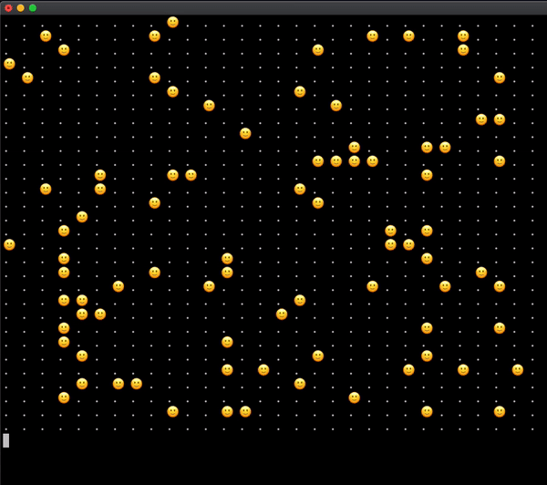

### Conway's Game of Life

Simple implementation inspired by https://www.youtube.com/watch?v=vurOFN7-72w



To run the game just call from terminal
```bash 
ruby lib/main.rb
```

In [lib/main.rb](lib/main.rb) there are three configurations for initial position of cells:
 - random
 - glider: alive cells will move from the top left corner to the bottom right
 - block: cells will not evolve and game will stop on the second evolution step  
